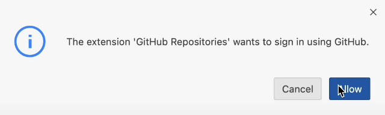
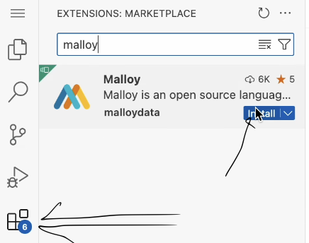
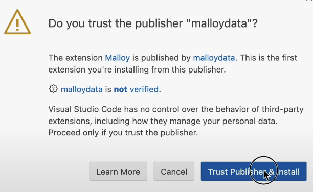
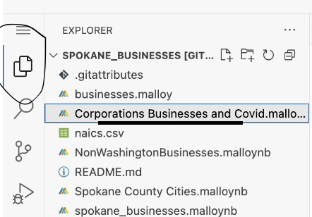
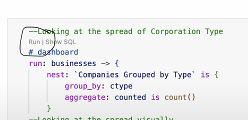

This project uses [Malloy](https://www.malloydata.dev/) Data Analysis tools to evaluate data provided by [The Data Liberation Project](https://www.data-liberation-project.org/). Providing this data via [Github](https://github.com/) enables others to run their own analysis on the data to come to their own conclusions

## Findings from the data
Through analysis that includes using group by and aggregate functions amongst others, I was able to navigate the data and answer interesting questions that often led to more interesting questions. I will walk you through some of the more interesting information I uncovered.

#### 1. What was the most common type of chemical loss

#### 2. What states lost the most chemicals 

#### 3. What was the largest single loss of chemicals per year?

#### 4. What were the largest single losses by business activity 

## Directions on How to Use GitHub Web Editor

Are you logged into github? Just press the period key right now. This will load the web editor. Then install the Malloy extension. Feel free to explore, experiment, and learn more about Peace Corps Volunteers!
See images below for direction references:
| **Step**   | **Image Preview** |
|--------|-----------|
| `Step 1 - Press allow` |  |
| `Step 2 - Click the Blocks, search for Malloy, install` |  |
| `Step 3 - Click Trust` |  |
| `Step 4 - Click a .malloynb file` |  |
| `Step 5 - Press Run` |  |
